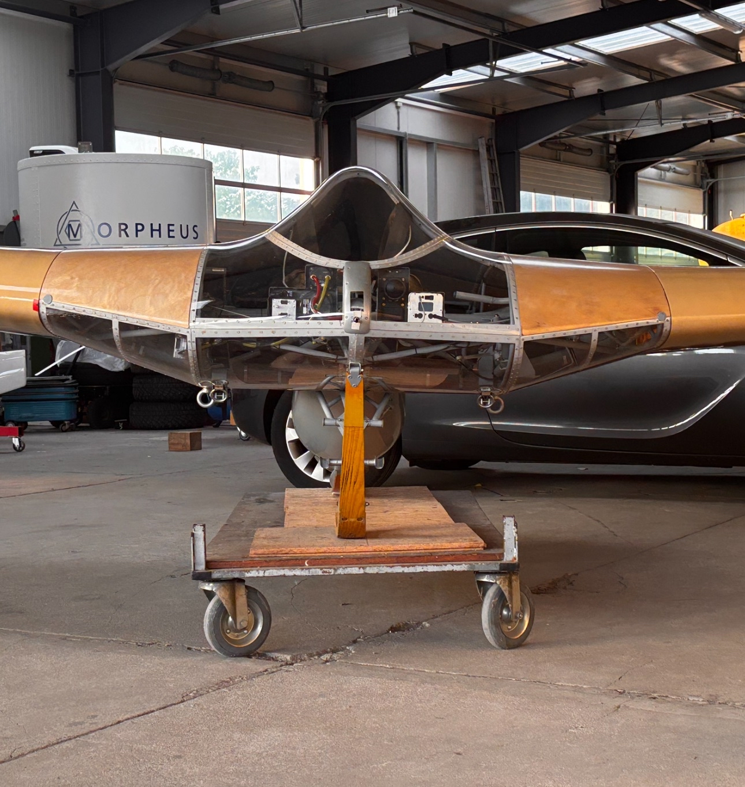
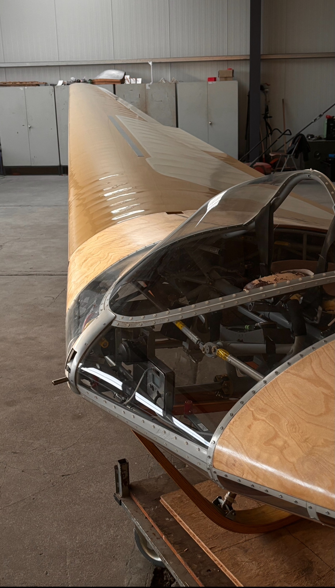
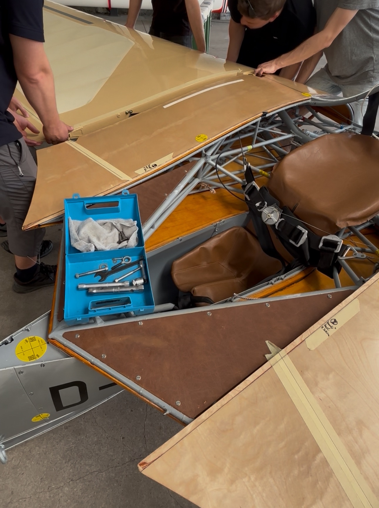
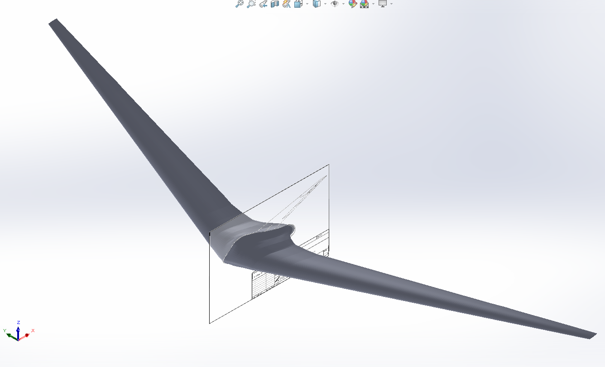
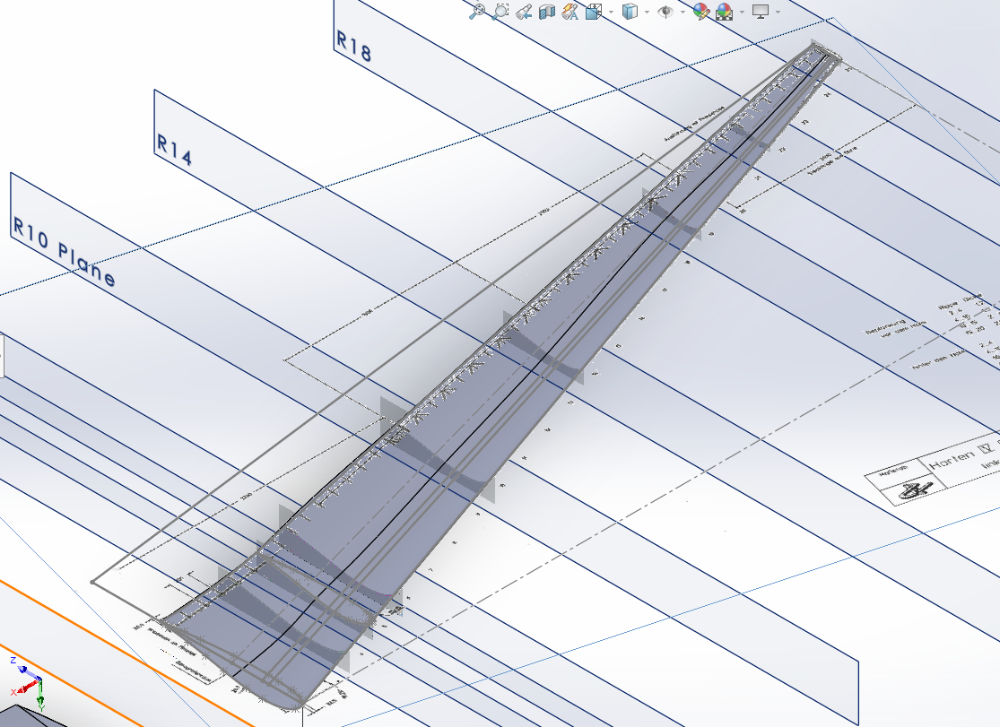
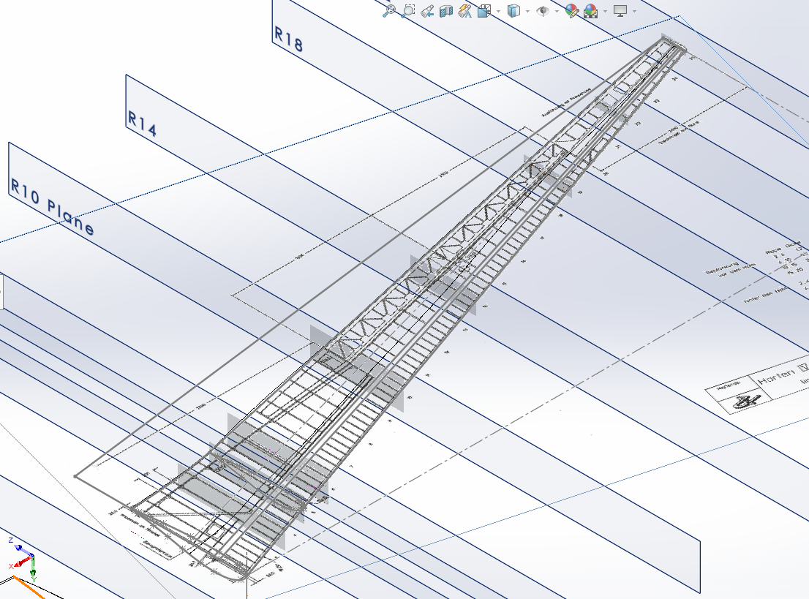

# AKAFLG-Ho.-IV

  

  
  
  

## 1.0 File descriptions:

### 1.1 Airfoils
The following are the 33 air foils that were extracted from a excel database. the body foils are 3D scanned from the actual horten IV itself, while the wing foils are from technical drawings.

### 1.2 HortenXFLR V7 Back up.xfl
Made in xflr5 v6.61, the xlfr5 file contains all WIP models. A model with flaps, a moel with varying Iyy values, and the bsae model called Horten IV V2, where i varied the CoG location from 1.3 to 1.55

## 1.3 Standered Graphs
As the name implies these are the standered graps taken from XFLR5. There is a legend included in the picture which shows the affect moving the CoG has on the Short period

## 1.4 MIL STD 1797A
Data from the horton overlayed with MIL STD 1797A for catagory B flight phases (cruse)

## 1.5 MIL-F-8785C data
Data from the horton overlayed with MIL-F-8785C for catagory B flight phases (cruse), showing level 1 and level 2 (details in folder)

## 1.0 Digital Mock Up

  
  

